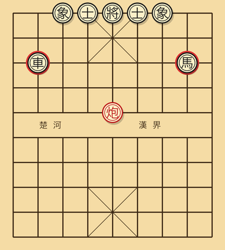
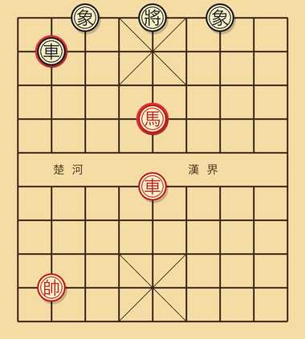
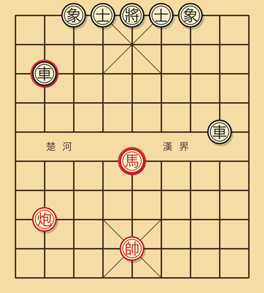
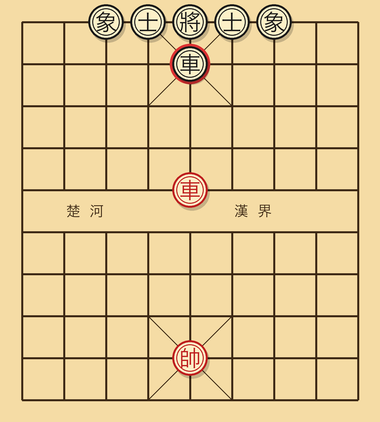
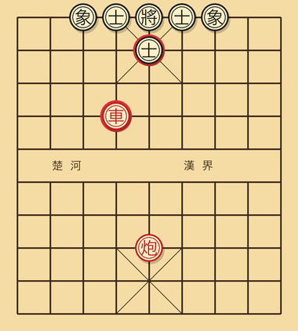

---
---

# 第二章 基本战术

战术指的是短期内能够带来明确得失的招法组合。归根结底，几乎所有战术追求的都是同一件事：**用一步棋同时威胁两个目标，让对方顾此失彼，被迫接受其中一项损失**。这一思路一旦在脑子里形成习惯，看局面时就会自然去寻找"哪两件事可以用同一步连起来做"。

入门玩家很容易把"战术"和"杀棋"混在一起来理解。实际上战术是更基础的层级。一招漂亮的捉双未必能够当场把对方将死，但是它可以让你赢下一颗子；赢一颗子之后，再借助本书第七章里讨论过的兑换简化技巧，逐步把局面引导到自己有利的残局，最终把局赢下来。这是入门到提高这一段最常见、也最稳定的赢棋路径。

本章一共会介绍七种最常用的战术，每一种都配有图示局面，便于在脑子里建立印象。

## 2.1 捉双

捉双指的是用同一步棋同时攻击对方的两个棋子，使对方只能保住其中一个，不论怎么应都要丢掉另一个。



**典型形状之一**：

```
红炮二平五。这一步在中路架起炮的同时威胁中兵，
如果黑车此时正好和这一炮处在同一直线上，
就构成了对中兵和黑车两个目标的同时攻击。
```

下面是一个更具体、更接近实战的例子：

```
黑方车 6 进 3 走入红方下二线，在攻击红方三路马的同时，
也威胁着进一步沉底形成更大压力。
红方必须先把马移开避兑，黑方下一步可以走车 6 平 7，
顺势吃掉象，或者继续向底线方向抄底。
```

**入门要点**：寻找捉双机会的方法并不神秘。最简单的扫法是在棋盘上找两类目标，一类是开局到现在还没动过、位置比较拥挤的子，另一类是当前没有任何己方子保护的子。如果场上恰好有两颗这样的子相邻或者处在同一直线上，那么用一颗远程子（车、炮或者过河马）就极有可能同时攻击它们。

## 2.2 抽将

抽将的核心在于：走一步棋既能让己方另一只子产生将军，自己又顺势移动到对方某个有价值的位置。被将的一方必须先去解将，于是原本应当被保护的目标就在这一回合里被吃掉。



**经典图形**：

```
红车在五线，黑将也在五路同一直线上，两者之间挡着一只红马。
红马进四，让开车的射线，与此同时马自己跳到一个能威胁黑车的位置。
黑方因为车此刻正在被将军，必须先把将走开或者用子挡将，
红马在下一回合就能吃掉黑车，完成抽将获利。
```

抽将的关键，是**走出去的那只子（在这里是马）落到的每一个位置都顺手能做事**：可以吃子，可以占据要点，可以转身再去捉一只对方的子。正因为如此，抽将常常和捉双结合使用：解开抽将的同一步里，再顺手捉对方一只关键子，一回合之间收获往往是双份的。

## 2.3 闪击

闪击的形式和抽将相似，区别在于走子之后并不会形成将军，而是直接攻击对方的一只关键子。对方必须先去应付这一处突如其来的攻击，原本应当被保护的另一只子也就被丢掉了。



**例子**：

```
红车走到七路底线，黑车也在七路靠近三线的位置，两者之间正好隔着一只红炮。
红炮平到八路，与此同时攻击黑炮，红车的直线也因此恢复，
和黑车直接形成正面对峙。
此时黑方处境非常被动：移动车就会丢掉炮，移动炮则要丢掉车，
两件事必须二选一。
```

闪击和抽将的最大区别在于威胁的性质：抽将要求对方必须先解将才能再考虑别的事情，闪击则是同时摆出两件大事，逼迫对方在两次损失之间做出选择。两种战术的精神是一致的，都是借一步棋同时做两件有威胁的事。

## 2.4 牵制

牵制的目的是让对方的某一只子事实上动不了，因为一旦它移动，就会引发更大的损失。



**两种典型的牵制形态**：

**绝对牵制**：被牵的子一旦移动，己方的将就会处在被将军的状态，按照规则属于送将，是不允许的着法。例如黑车正好处在红将和红马的同一直线上，红马若动，就等于把自己的将暴露给黑车，构成送将。这一类牵制是规则层面的强制效果，被牵的子在牵制解除之前完全没有动的可能。

**相对牵制**：被牵的子一旦移动，并不会违反规则，但是会丢掉更大的子。例如黑车后面藏着一只黑炮，红车在前面顶住黑车。这种局面下黑车一旦移动，红车就能直接吃掉藏在它身后的炮，损失明显大于继续被牵。

牵制是中局阶段最常用的战术之一。**被牵的子，几乎相当于退出了战斗**：它既无法移动，又占用着一个本来可以由别的子占用的格子，等于己方在战斗中少了一个有效兵力。

**应对牵制**的思路只有两条：要么调动其它子去保护牵制线上的那个真正的目标，让对方即便吃也得不到便宜；要么干脆主动兑换掉发起牵制的那只对方子，把整个牵制结构拆掉。

## 2.5 引离

引离也叫调虎离山，指的是用一步带有强威胁的招法，迫使对方一只承担关键防守任务的子离开它原本的位置，然后从这个空出来的位置发起进攻。



**例子**：

```
黑方在 5 路和 4 路都布有士，把中宫护得很严。
红方此时已经布好重炮想要做杀，但是中路的士牢牢拦住攻击线，
炮无法直接形成杀棋。
红车四平五，进车吃黑士的同时形成将军。
黑方只能用 5 路的士回吃这只车，原本守在中路的士被迫离开关键位置。
红方下一步用炮重将，构成杀棋。
```

引离是中高水平棋手最常使用的手段之一。识别引离机会的方法是**先看对方阵型里哪一只子在承担最关键的防守任务，然后问自己：如果这只子不在了，局面会变成什么样**。如果答案是"我马上就能形成杀棋"，那么哪怕花费一颗子、甚至一只车去把它强行调开，也是值得的。

## 2.6 堵塞

堵塞是把对方将帅原本可能走出去的某一条逃跑路线封死，使杀棋得以成立。这种手法在残局阶段攻王时出现得最为频繁。

**例子**：

```
红车将军黑将，黑将位于 5 路底线，红车在 5 路对面的将一位置，
黑方此时的唯一逃跑通道是 4 路的一格空位。
红炮二平四，把炮调到 4 路同一条直线上，
下一步借助黑方的士做架子，准备形成炮架做杀。
此时黑将如果逃到 4 路，反而落入红炮的射程之内，被进一步锁死。
```

堵塞与封锁本质上是同一件事：你不一定要直接攻击对方的将，只要把它所有可能走的格子提前掐死，等到将军一出，对方便无路可去。把杀棋拆解开来看，最后一手必杀总是建立在前面几手对逃跑路线的封堵之上。

## 2.7 兑子

兑子指的是用己方一只子换取对方价值相当的一只子。表面上看是亏盈相抵，没有得失，但实际上兑子是非常重要的战术工具，可以用来达成多种不同的目的：

- **简化局面**：在占优势的一方主动兑子，可以让剩余子力更少，局面更容易控制，对方反击的空间也会随之收窄。
- **消除威胁**：当对方某一只子构成持续威胁时，主动把它兑掉，是最直接的解除危险的办法。
- **打开缺口**：兑掉对方的关键防守子，例如中士或者中相，可以为后续的攻王打开一条通道。

需要注意的反面情况是：**当己方处于劣势时，应当尽量避免主动兑子**。剩余子力越少，劣势的一方腾挪空间越窄，最终往往被对方一步步逼到死角。

入门玩家在兑子上最常犯的错误，是**毫无意义的兑子**。两只马刚刚在中路相遇，看上去就要开打，于是顺手兑了。兑完之后才发现自己一侧的阵型反而变松，对方的子力则因为这次兑换更加集中。每一次准备兑子之前，都应当先问自己一句：兑完之后整体局面对我是更好还是更差？如果答案不确定，宁可暂时不兑，多等一两步。

## 2.8 综合例题

下面是一个典型的入门级战术组合，包含了本章讨论过的多种思路。请先用纸盖住答案区域，自己思考至少三十秒以上再去看解答。

**局面**：红方先走。

- 红车一在底线 1 路。
- 红炮二在二路五线，与黑将处在同一直线上，中间隔着一颗黑士。
- 黑车 9 在 9 路 4 线，没有任何子保护。
- 黑将在 5 路底线。
- 黑双士在 4 路、5 路。
- 黑双象在 3 路、5 路。

**问：红方应当怎样走，可以稳定获利？**

<details>
<summary>答案</summary>

正解是**红车一平五**，这一步同时蕴含了多重战术意图：

1. 这步棋直接攻击位于 5 路的黑士，构成捉子的威胁。
2. 让出了 1 路通道之后，更重要的效果是车进入中路 5 线，与原本就在 5 线上的红炮一并形成对黑将的潜在夹击。

黑方此时无论如何应对，都难以两全：

- 如果黑士走开，例如走士 5 进 4，那么红方下一步车一进九沉底，与中路炮配合，可以直接形成杀棋。
- 如果黑用车回防，例如走车 9 平 5，那么红炮二进三可以先吃黑士叫将，黑车被迫回吃，红炮再借助后续车的支援展开攻王。

这一例题之中，捉双、引离与攻王三种战术依次贯穿其间，可以反复揣摩。

</details>

---

[← 上一章](01-棋子价值.md) | [下一章 → 第三章 基本杀法](03-基本杀法.md)
