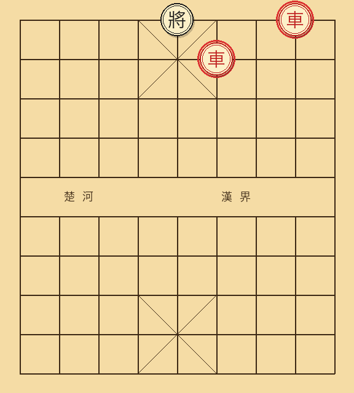
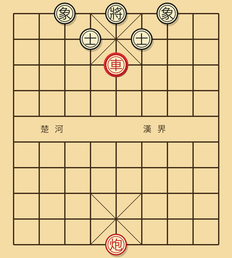
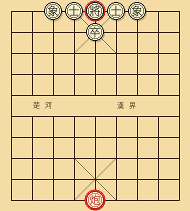
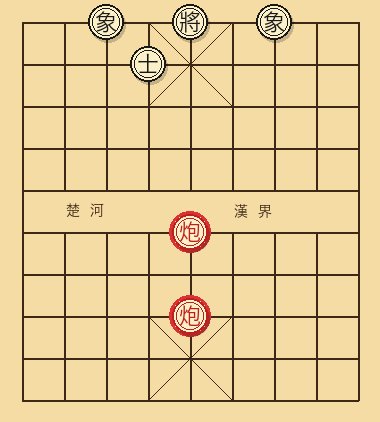
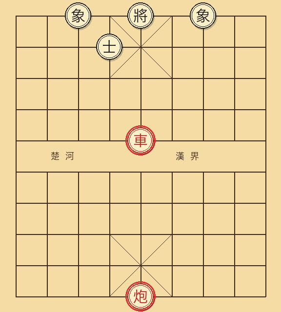
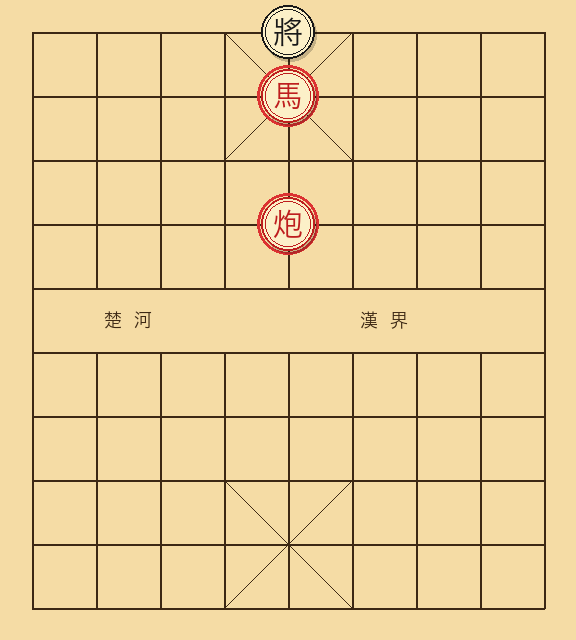
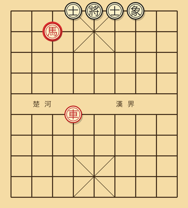
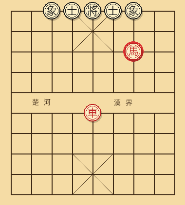
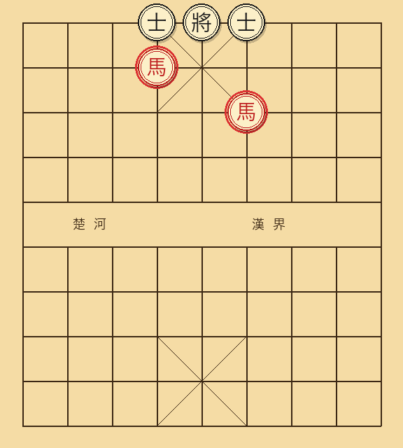
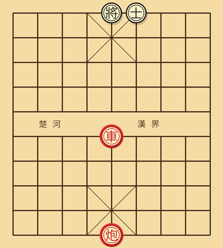

---
---

# 第三章 基本杀法

下棋练到深处，手上最吃紧的肌肉记忆就是杀法。整本书翻下来，要是只挑得出一章让人反反复复回看、在盘上一遍遍重摆，那必定就是这一章。

初学的人想把棋力提进中等水平，最快也最稳当的路子，无非是把下面这十几种典型杀法牢牢记在心底。各种杀型的样子都要练到“一眼识别”的火候：一见这副架势，立刻便知局面里伏着杀机，或是离成杀只差一颗子，用不着一步一步费力推演。算度只是辅助，眼前的识别才是底子。

学起来其实就按一个简单的步调来：每种杀法读过讲解，先把图形在心里记个大概，接着合上书，自己在棋盘上原样摆上一回；隔天抽空再独立摆一次；等过了一周，要是不用翻书还能把这套杀型顺畅摆出来，就算是真正吃透了。这样下一番功夫，比一口气读完十种杀法却始终不动手，要扎实得多。

这一章总共讲十种最常见的杀法。

## 3.1 双车错（双车胁士）

**形状要点**：双车各占一条直线，一并压进对方底线。一只车负责将军，另一只负责掩护接应，两只车搭在一起，构成了致命的联手攻势。



**经典图形**：

```
红车一停在 8 路的底二线位置，红车二停在 6 路的底二线位置。
黑将位于 5 路底线，双士此时要么已经被吃光，要么被双车牢牢牵制。
```

**杀法过程**：

```
红车一进一，沉底将军黑将。
黑方只能选择用士挡或者把将走向中路。
红车二再进一，与第一只车形成相互掩护，黑方无路可救，被将死。
```

**记忆要点**：只要双车从左右两翼一齐插进底二线，碰上对方士象残缺，这盘棋基本就交代了。正因如此，各派开局无论怎么变，“飞士飞象”都是少不了的防守底子：士象齐全，到了中后局才能扛得住双车联手的轮番扑击。

## 3.2 大胆穿心

**形状要点**：用一只车或者一只炮直扎对方九宫中心，借着后方其它子力在后头掩护，一举成杀。



**最经典图形**：

```
红车位于 5 路的前方，已经过河进入对方阵地；
红炮位于 5 路的后方某处，沿中线为车提供射线掩护。
黑方双士分别在 4 路和 6 路（"开士"形状），中士位置没有保护。
黑将位于 5 路底线。
```

**杀法过程**：

```
红车进 5，直接冲入九宫，吃掉中士的同时形成将军。
黑方此时除了用将吃车之外没有别的应法。
红炮接着沿中线前进或者横平，将死黑方。
```

**记忆要点**：对方的双士要是摆成“开士”架式，分别守在 4 路和 6 路、中路空无一物，而己方中线上另有炮在后头照着，就得处处留神大胆穿心。“宁失双相，不失中士”这句象棋格言，正是为了防备这类直捣心窝的杀招才传下来的。

## 3.3 闷宫

**形状要点**：炮与对方的将同在一条直线上，将身旁所有能挪步的空格，也全被自家的士、象和别处子力塞得严严实实。炮往当头一叫将，对方竟找不出哪怕一步活路。



**经典图形**：

```
红炮位于 5 路中线，与黑将之间隔着一颗中士。
黑方双士仍守在 4 路、6 路，双象仍在 3 路和 5 路。
黑将位于 5 路底线，被自家所有的士象层层包围。
```

**杀法过程**：

```
红方借助一次将军或其它强迫手段，把中士引开。
随后红炮直接沿中线将军。
此时黑将被自家士象牢牢圈在原地，无法跳脱，是为"闷宫"。
```

**记忆要点**：黑方士象全在、规规矩矩停在原位上，反倒最容易撞上闷宫。只因将帅的挪动路线全被自家子力堵死了，只要攻方设法调开中士，留下的士象半点帮不上忙，反倒成了把主帅困死在里头的牢笼。

## 3.4 重炮

**形状要点**：两只炮前后叠在同一条线上，前炮拿后炮当炮架直接打将，挨打的将帅根本找不出别的子力来垫挡。



**经典图形**：

```
红炮二停在 5 路靠前的位置，作为前炮；
红炮八停在 5 路靠后的位置，作为后炮，两炮同处中线。
黑将位于 5 路底线。
中士此时已经被引开，或者本来就不在中路。
```

**杀法过程**：

```
前炮沿中线直接将军，例如炮五进若干。
后炮则作为架子，黑方因为中士已不在原位，没有其它子可以挡架。
黑方将死。
```

**记忆要点**：双炮前后叠在一条直线上，砸向中宫的分量极重。开局起步就得留神对方一点点把双炮挪往中路的心思，真等两只炮在中线架稳了，回过头再去拆解可就难上加难。

## 3.5 铁门栓

**形状要点**：一只车扎进对方中线，另一只炮在车后头沿中线提供掩护，将与车迎面相对，在中路结成一道“前后栓死”的封锁架势。



**经典图形**：

```
红车位于 5 路、五线，已经过河进入对方阵地。
红炮位于 5 路、自家底二线，与车处于同一条中线。
黑将位于 5 路底线。
中士已经被吃掉或者被引开。
```

**杀法过程**：

```
红车继续沿中线推进，沉底将军，直接占据中宫位置。
黑方无法用中士挡架，因为中士已经空缺；
也无法用己方车去挡，因为后方红炮顶住整条中线，黑车一动就会被吃。
黑方将死。
```

**记忆要点**：这套杀型的关窍，在于红车先一步在中线上“压上去”，红炮则在后方牢牢“顶住”任何试图来救驾的黑车。打个通俗的比方，就像是用一根重铁栓把对方大门前后闩死，里头的人冲不出来，外头的救兵也闯不进去。

## 3.6 马后炮

**形状要点**：马紧挨在对方将的身侧，炮停在马正后方的同一直线上，正好隔着这只马当作炮架。马挪出一步叫将，对方的将帅便再无路可逃。



**经典图形**：

```
红马位于 5 路、底二线，紧紧挨着黑将。
红炮位于 5 路、底三线，正好处在马的正后方，沿中线与将共线。
黑将位于 5 路底线。
```

**杀法过程**：

```
红马进六（或者进四），从黑将的侧面构成将军。
黑将此时无路可走：左右两侧 4 路、6 路均被这只马的下一跳所控制；
若选择向前移动，则正好落入后方红炮的射线之内。
黑方将死。
```

**记忆要点**：在整个中残局阶段，马后炮算是最常见的一类杀型。辨认起来很是直观：只要黑将身前留出了空格，红方手头有一匹能贴近主将的马，后头另有一只沿同线撑起架子的炮，落子时第一反应就该去寻马后炮的杀路。

## 3.7 卧槽马

**形状要点**：红马跃入黑将左右斜下角的“卧槽位”，也就是黑方一侧 3 路或 7 路的二线，迎面叫将，再借着别处子力封死退路，联手做成杀棋。



**经典图形**：

```
黑将位于 5 路底线。
红马跳至 7 路、二线，恰好处在卧槽位上，
通过"日"字步法的攻击线，直接将军 5 路上的黑将。
```

**杀法变体**：

- **卧槽马配车**：黑将即便想挪步逃命，侧面的落脚格子也早被己方车封得严严实实，无路可走。
- **卧槽马配炮**：有炮封住整整一条直线，黑将往哪一侧挪动，都会撞进炮火的射程之内。

**记忆要点**：3 路和 7 路的“卧槽位”，是马在攻杀时最要紧的两个落脚点。开局要是已经压制住了对方的双马，自己就可以考虑用车沉底包抄，提早占稳对方 3 路与 7 路的二线，免得对方的马有机会跳进这些卧槽重地。

## 3.8 钓鱼马

**形状要点**：红马跳到黑将所在直线两侧的“钓鱼位”，也就是黑方阵地 3 路或 7 路的三线，一人把关，同时封死黑将向左向右的逃路，再由一只车在中线上起步叫将。



**经典图形**：

```
黑将位于 5 路底线，被双士保护。
红马位于 7 路、三线，处于钓鱼位上。
红车停在 5 路某个能够中线将军的位置。
```

**杀法过程**：

```
红车沿中线将军，例如车六平五。
黑将无路可逃：4 路方向被红马的一条"日"字攻击线所控制，
6 路方向则被同一只钓鱼马的另一条攻击线所控制。
黑方将死。
```

**记忆要点**：钓鱼马最出彩的地方，在于单凭一匹马，就能同时锁死对方将帅左右两侧的逃路，属于棋盘上极少数能以一抵二的险要位置。己方的马一旦落进钓鱼位，再配上中线上车的致命一将，往往当场便能锁成杀局。

## 3.9 双马饮泉

**形状要点**：双马同时调上去攻王。两匹马的步子互相照应、落点交错覆盖，对方的将无论怎么挪动，所有脱困的路线都已经被一并堵死。



**经典图形**：

```
黑将位于 5 路底线，仍由双士保护。
红方一只马位于 4 路、二线，处于挂角马的位置。
红方另一只马位于 6 路、四线，处于稍外圈的位置。
```

**杀法过程**：

```
外圈那只马跳到 5 路附近，向中宫附近发动将军。
黑将试图逃向 4 路，吃掉挂角马；
然而下一步外圈马就能跳到刚才挂角马的位置，再次构成致命攻击。
若黑将选择退向中宫，则被原本的挂角马直接跳回杀棋。
```

真到了实战对局里，双马杀往往有许多连续着法可用。关键还是两匹马步调的照应：它们互相配合，能同时控住三到四个格子，对方的将无论往哪儿挪，每走一步都仍落在被攻击的范围之内。

**记忆要点**：两匹马合力的威力，远不是单马所能比的。进入中残局，要是手里正好握着双马，而且都已逼近对方阵地，就该主动去抓双马成杀的机会，千万别轻易把其中一匹马兑掉。

## 3.10 海底捞月

**形状要点**：这是残局里极常见的一类杀法。一方用车占住中线（或是对方底线），一边将军，一边控住对方将的逃跑方向，再借着炮、兵或者相协同发力，把所有出路彻底锁死。



**经典图形（车炮联合）**：

```
黑将位于 5 路底线，士已经残缺，只剩一只或者全部丢失。
红车停在 5 路某处，处于中线之上。
红炮停在底二线某个位置，与车形成纵深配合。
```

**杀法过程**：红车沿中线一记叫将。黑将根本逃不出中线（肋路已被红炮牢牢控住），身边又没有足够的士象用来挡架，最终被红车直接将死。

**记忆要点**：只要对方士象残缺、王被迫退到了底线，“中线压车”几乎是最常用的攻法。海底捞月还有另一种典型形态，讲的是单车战胜对方单缺士的局面，这一部分会在第四章残局中单独详细讲解。

## 3.11 杀法总结表

| 名字 | 形状关键词 | 配合子 | 必备条件 |
|------|------------|--------|----------|
| 双车错 | 双车进底二线 | 无 | 对方士象残缺 |
| 大胆穿心 | 车冲中宫 | 炮在中线掩护 | 中士空 |
| 闷宫 | 中炮直照 | 无 | 对方士象齐全反成累赘 |
| 重炮 | 双炮叠中线 | 无 | 中士空 |
| 铁门栓 | 中线压车 | 后炮顶车 | 中士空 |
| 马后炮 | 马近王，炮远端同列 | 无 | 王前方有空 |
| 卧槽马 | 马在 3/7 路二线 | 车或炮 | 对方士象残缺 |
| 钓鱼马 | 马在 3/7 路三线 | 中线车 | 无特别要求 |
| 双马杀 | 双马近王 | 无（主要靠双马本身） | 王周围空间狭小 |
| 海底捞月 | 中线车攻王 | 炮或兵 | 对方士象残缺 |

## 3.12 怎么练

每天花上五分钟左右，做五道杀法题（一步杀、两步杀和三步杀各挑几道），坚持三十天，成效就会非常明显。这类训练强度其实不大，要紧的是天天不落，每天都把这些杀法图形在眼前过上一遍。

像天天象棋、棋天下、JJ 象棋这些手机应用，都自带“杀法库”或者“残局闯关”功能，单是免费部分的题目，就足够支撑几个月的练习。挑选其中一个长期跟下去就好，不必同时使用好几个 App。

**关键提示**：做题的时候必须先自己算到底，得出明确结论之后再去翻看答案。算错的题应当单独记录下来，第二天再去试一次。同一道题如果在不同日期里错过三遍以上，说明对应的杀型在记忆中还没有真正成型，需要回到本章相应小节重新读上一遍。

---

[← 上一章](02-基本战术.md) | [下一章 → 第四章 实用残局](04-实用残局.md)
