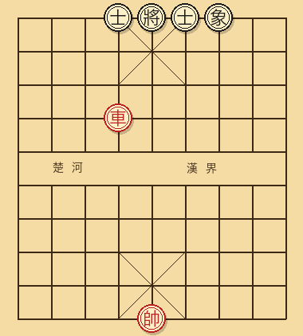
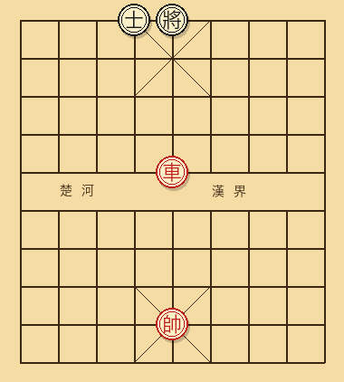
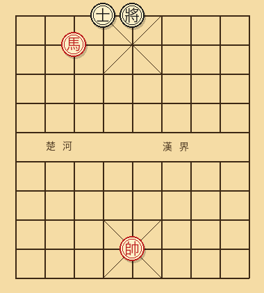
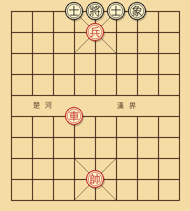

# 第四章 实用残局

残局是基本功的最后检验。

入门玩家的常见经历：明明中局子力领先，进入残局之后却被对方逼和，或者干脆被反杀。问题不在于"不会下"，而在于不知道**子力组合的标准胜负判定**。象棋的残局结论很多是定型的：单车胜士象全、单马难胜单士、车低兵必胜单士单象——这些是必须背的，背完不仅省算度，下中局时也能更准确地判断什么时候该兑子简化。

本章讲六类最常见的实用残局。每类给出胜负结论 + 标准走法。

## 4.1 残局判断的总原则

判断一个残局是不是必胜/必和，问三件事：

1. **强方有没有有效的攻击子？** 车是最强的攻击子；炮和马在不同条件下强度不同。
2. **弱方士象齐全吗？** 士象是防守的根本。士象齐全的弱方非常难攻。
3. **强方有没有过河兵？** 一颗过河兵在残局价值约等于一颗炮，往往决定胜负。

**通用结论速查**：

| 强方 | 弱方 | 结论 |
|------|------|------|
| 单车 | 单士、单象 | 强方胜 |
| 单车 | 双士、双象 | 强方胜（士象全略难，但仍胜） |
| 单车 | 士象全 | 和棋（标准海底捞月技术） |
| 单马 | 单士 | 一般和棋（少数特殊位置可胜） |
| 单马 | 单象 | 和棋 |
| 单马 | 双象 | 和棋 |
| 单马 | 双士 | 和棋 |
| 单炮 | 单士 | 和棋（必须有架子才能将） |
| 单炮 | 单象 | 和棋 |
| 单炮 | 士象全 | 和棋（弱方注意防穿心） |
| 马炮 | 士象全 | 强方胜 |
| 双马 | 士象全 | 强方胜 |
| 双炮 | 士象全 | 强方胜 |
| 单车 + 单兵 | 士象全 | 一般强方胜 |

注意"和棋"是说**双方都正确应对的情况下**。如果弱方走错，照样会输。

## 4.2 单车胜单缺象（实战常见）

**局面**：红方一车，黑方双士单象。



**核心思路**：把车开到对方的"少象一侧"，从对方缺象的那条肋路抄底攻王。

**标准操作**：

```
假设黑缺 3 路象（即只有 7 路象）。
红车一平四（开到 4 路），向右抄。
红车四进三、车四平五、车五进二，沿对方右半边往底线压。
最终在 4 路或 5 路底线将军，黑士象掩护不到，必死。
```

**关键技术**：

- 让车走到对方**少象的那一侧**。
- 控制对方将的横向逃跑路线。
- 利用"将不照面"规则把对方将逼到角落。

## 4.3 单车胜单士（基本功）

**局面**：红方一车，黑方仅一士。



这个局面看似简单，但很多入门玩家会让对方逼和，因为不会用"将照面"这个工具。

**标准胜法**：

```
1. 把红将开到中路（关键）。这一步保证后续可以利用"将照面"逼黑将进入死角。
2. 红车从中线、肋线包抄黑将。
3. 黑将每次想跨到中路，红将就横过去阻止（不能让两将照面）。
4. 把黑将逼到底线一角，最后用车将死。
```

实战时**不要急着将军**，先把己方将开到中路再说。这是最常见的败着：一上来就将军，导致黑将跑到中路，然后红方因为己方将不在中路、对方不能照面规则用不上，逼和。

## 4.4 海底捞月（车胜单缺士）

**局面**：红方一车一炮（或一兵），黑方仅缺一士（士象全里少一颗士）。

**胜法骨架**：

```
红车占中线（5 路）。
红炮 / 红兵守住肋线，防止黑将跨过。
红车上下移动叫将，黑将无路可逃。
```

这就是"海底捞月"杀法的实战版。

**关键技巧**：红车在中线"巡视"，每次黑将试图逃，都用车堵住。

## 4.5 单马胜单士的边角胜势



理论上单马难胜单士。但实战中如果黑方士的位置不好（被困在角落、或将位置不好），单马有时候能胜。

**胜势条件**：

- 黑将被逼到底线角落。
- 黑士不在双士齐全的"原始位置"。
- 红马能跳到卧槽位或挂角位，控制黑将的逃路。

入门玩家不需要记单马胜单士的具体着法。只需记住：**轮到你处理这种残局时，主动兑子，简化为单马对光将**——光将（光秃秃没有士象的将）几乎必败。

## 4.6 车低兵必胜单缺象

**局面**：红方一车一兵，黑方双士单象。



这是残局教学最经典的局面之一。"低兵"是指兵推到了对方底二线甚至底线。

**胜法核心**：

```
红兵推到对方底二线，作为"工具"用。
红车牵制黑士象。
最后用兵把黑将"挤到"必杀位置。
```

具体走法变化很多，但骨架就是兵 + 车配合，把对方将的活动空间压缩到一两格。

**关键提示**：兵推过河之前，必须先用车做掩护，不然兵一过河就会被吃。

## 4.7 同等子力的残局——为什么"先手"重要

车 vs 车、马 vs 马、双士 vs 双士……同等子力的残局看似必和，但**先手方**往往能凭借一点点位置优势把局面演化成胜势。

例：双方都是马 + 兵 + 双士双象，红先。如果红马的位置稍好（比如已经过河），红可以通过先逼黑士、再吃黑兵的方式赢一颗子，最后过渡为马兵胜单缺象的胜势局。

**对入门玩家的启示**：进入残局后，**先手 + 主动**比子力上的微小优势更重要。一个抢到先手的劣势方，常常能通过逼和成功；一个失去先手的"理论胜势方"，可能反而输掉。

## 4.8 入门玩家的残局五条铁律

1. **手中有车，先把己方将走到中路**。绝大多数车残局都需要中路将的配合（防止照面、利用照面）。
2. **不要急着推兵**。兵推过河之前要有车马掩护。一颗孤兵被吃，棋就垮了。
3. **马在残局比炮强**。能换尽量保留马，把炮兑掉。
4. **士象齐全的弱方很难输**。如果你是弱方，永远先飞士飞象、保持士象齐全；如果你是强方，攻王之前先想办法吃对方一只士或一只象。
5. **不会下的残局，主动求和**。残局里走错一步可能从胜势变和棋，或从和棋变败势。不熟的局面，控制兑子简化、把局面带向自己懂的形态。

---

[← 上一章](03-基本杀法.md) | [下一章 → 第五章 开局原理](05-开局原理.md)
