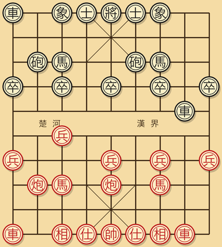
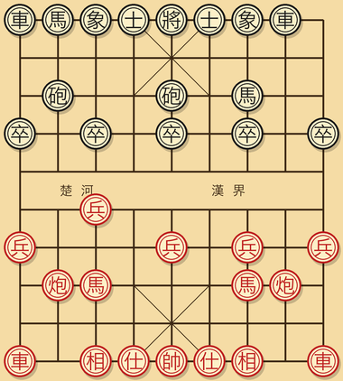
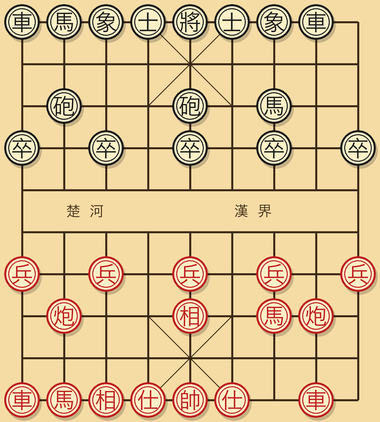
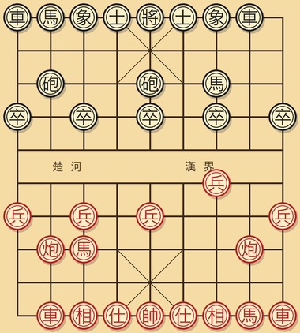
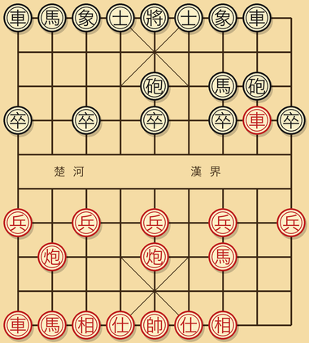

# 第六章 常见开局

本章给出五个最常用开局的"骨架走法"。注意是**骨架**，不是定式。骨架是说前 6-8 步双方大致这样走，之后会分出十几种变化，那些变化书里不展开。

学开局的正确方法：

1. 把骨架走法在棋盘上摆 3 遍，背下前 6 步。
2. 找对手实战，按骨架开局，下到第 7 步之后凭原理走。
3. 输了之后用引擎复盘，看自己第几步开始走差。
4. 把那一步的变化记下来，下次记住。

每一个开局打 50 盘左右，你就能比对方多懂得多。

## 6.1 中炮 vs 屏风马（最经典对局）

红方先走中炮，黑方屏风马应对。这是棋谱出现频率最高的开局。


**骨架**：

```
1. 炮二平五      （红方中炮，瞄准中兵和黑方士角）
   马 8 进 7    （黑右马，屏风马右翼）
2. 马二进三      （红跳右马，保护中兵）
   车 9 平 8    （黑左车开到 8 路）
3. 车一平二      （红开右车，呼应左炮）
   马 2 进 3    （黑左马，屏风马合体）
4. 兵七进一      （红挺七路兵，给八路马让路）
   卒 7 进 1    （黑挺 7 路卒，对应）
5. 马八进七      （红跳左马）
   炮 8 进 4    （黑左炮过河，进攻态度）
6. 炮八平九      （红八路炮平边，让出八线给车）
   车 8 进 4    （黑车也过河）
```

**走完 6 步后双方阵型**：

- 红方：双马屏风（三、七路）、双车在二、八路、双炮架在五路和九路。中兵突出。
- 黑方：双马屏风（3、7 路）、双车都已过河（开始攻击）、左炮过河。

**核心思想**：

- 红方目标是**中路压制**。中炮死盯黑方中卒，黑必须用马护中，所以黑双马自然形成屏风。
- 黑方目标是**左翼反击**。黑左车 + 左炮 + 7 路卒形成左路攻势，企图对红方右翼施压。

**入门要点**：

- 如果你执红，记住**不要轻易动中炮**。中炮是核心攻击子，一旦平开，整个中路压制就没了。
- 如果你执黑，记住**屏风马的两只马是骨架**。不到万不得已不要兑掉这两只马中的任何一只，否则屏风形被破坏，红方中路就能突破。

## 6.2 中炮 vs 反宫马

反宫马是屏风马的近亲，黑方加一颗炮在中路保护。



**骨架**：

```
1. 炮二平五
   马 2 进 3    （黑右马）
2. 马二进三
   炮 8 平 6    （黑左炮平到 6 路：反宫马的标志一步）
3. 兵七进一
   马 8 进 7    （黑左马也屏风一下）
4. 马八进七
   车 9 平 8    （黑左车出动）
5. 车一平二
   车 8 进 4    （黑左车过河）
```

**反宫马 vs 屏风马的区别**：

- 反宫马**多了一颗炮在中路 6 路**，给中宫多一层保护。
- 反宫马的左马是 8→7 进的，所以 8 路的车出来不被自己马挡。
- 反宫马一般攻势比屏风马稍弱、但防守稍强。

**适合的人**：求稳的黑方棋手。反宫马输得慢但赢得也慢。

## 6.3 仙人指路（先手开局）

红方先走"兵七进一"或"兵三进一"，等待对方表态。



**骨架（兵七进一）**：

```
1. 兵七进一
   炮 8 平 5    （黑反将一军：黑反炮中）
2. 马八进七      （红出马护中）
   马 8 进 7    （黑屏风半成）
3. 马二进三      （红另一马也跳）
   车 9 平 8    （黑出左车）
4. 车一平二
   ...
```

仙人指路的核心是**弹性**：兵七进一这一步几乎没有缺点，对方走什么我都能应。如果对方下中炮，我用屏风马反；如果对方下飞相，我可以中炮强攻。

**适合的人**：稳健派的红方。仙人指路开局下错的成本最低，特别适合入门玩家防错。

## 6.4 飞相局（先手开局）

红方第一步飞相（相三进五），最保守的开局。



**骨架**：

```
1. 相三进五
   炮 8 平 5    （黑直接中炮，反客为主）
2. 马二进三
   马 8 进 7
3. 车一平二
   车 9 平 8
4. 兵七进一
   ...
```

**特点**：飞相局放弃了开局先手的攻势，换取阵型稳固。下完 6 步红方还在防守姿态，黑方反而像先手。

**适合的人**：实力明显高于对手时使用。飞相局是"用稳定打混乱"的开局，对手如果是入门玩家，飞相局之后他大概率会乱攻、自己阵型先垮。

入门玩家自己**不建议**用飞相局，理由是：你失去了开局的攻势，必须靠对手犯错才能赢。如果对手不犯错，你很难找到主动机会。

## 6.5 起马局（先手温和开局）

红方第一步走马八进七或马二进三，温和开局。



**骨架（马八进七）**：

```
1. 马八进七
   炮 8 平 5    （黑中炮）
2. 车九平八      （红开左车）
   马 8 进 7
3. 兵三进一
   车 9 平 8
4. 马二进三
   车 8 进 6    （黑左车过河抢先）
```

起马局介于中炮和飞相之间。比飞相主动一点，比中炮温和很多。

**适合的人**：先手稳健派。

## 6.6 顺手炮（双方都中炮）

红中炮，黑也走 5 路中炮（相同方向），叫顺手炮。



**骨架**：

```
1. 炮二平五
   炮 2 平 5    （黑顺手炮）
2. 马二进三
   马 8 进 7
3. 车一平二
   车 9 平 8
4. 车二进六     （红车过河，主动攻击）
   ...
```

顺手炮节奏快，双方对攻。黑方虽然是后手中炮，但因为也占了中线，攻防对等，残局后手稍亏。

**适合的人**：喜欢对攻的棋手。

## 6.7 开局选哪个？

入门玩家的开局学习路线：

**第一阶段（前 200 盘）**：

- 红方固定走**中炮 vs 屏风马**。
- 黑方固定走**屏风马反中炮**。
- 不要换。不会两套以上的开局没关系，会一套打透了再说。

**第二阶段（200-500 盘）**：

- 红方加一个**仙人指路**作为备选，对付那些用古怪开局想偷袭你的对手。
- 黑方学**反宫马**作为屏风马的备选。

**第三阶段（500 盘以后）**：

- 根据自己的风格选定主流派。攻型选中炮和顺手炮；守型选飞相和反宫马。

## 6.8 一盘完整对局示例

下面是一盘典型的"中炮 vs 屏风马"骨架对局，从开局走到中局过渡。看一遍感受一下完整节奏。

```
红          黑
1. 炮二平五   马 8 进 7
2. 马二进三   车 9 平 8
3. 车一平二   马 2 进 3
4. 兵七进一   卒 7 进 1
5. 马八进七   炮 8 进 4
6. 炮八平九   车 8 进 4
7. 车九平八   炮 2 进 4    （黑双炮过河，对攻态势）
8. 兵九进一   炮 2 平 7    （黑炮平 7 路打红马）
9. 马三退一   炮 8 平 7    （黑双炮叠在 7 路，重炮形成）
10. 车二进九  马 7 退 8    （黑兑车，避免红车过河）
11. 车二平四  ...           （进入中局）
```

这一盘开了 10 步，已经形成了非常复杂的中局局面。双方各有得失：

- 黑方两炮过河打的红方阵型有点散乱，但黑方左马也退了一格，效率打折。
- 红方右车被兑掉，但右马回到底线后获得了对中宫额外的支持。

如果在这个节点暂停，**两种引擎判断会差不多均势**，反映了"中炮 vs 屏风马"开局选择的对称性。

---

[← 上一章](05-开局原理.md) | [下一章 → 第七章 中局策略](07-中局策略.md)
