---
---

# 第八章 练习题

研读完前七章理论之后，必须经由充裕的实战习题推演，方能将战术构想内化为敏锐的空间直觉。本章精选二十道实战题目，依由浅入深的阶梯排列，涵盖一步杀、两步杀、三步杀以及综合战术四大层级。

**推演法则**：

1. 推演之前务必遮挡答案区域。建议将局面复现于实物棋盘或对弈软件之中。
2. 保持至少半分钟的独立深算，得出确切结论后再对照参考题解。
3. 推演失误之题务必单独做好标记，翌日脱谱重拆。
4. 全套二十题初次完成后，宜打乱次序重测一轮，以检验直觉记忆的稳定性。

若能在无提示状态下独立解出十五题以上，表明棋力已然稳步跨入业余中坚水平。

---

## 一步杀（题 1 至题 5）

### 题 1

红方先走，一步杀。


```
红：车二在 5 路、底二线；炮三在 5 路、中线（即在车的更上方一格）。
黑：将在 5 路底；双士在 4、6 路。
```

<details>
<summary>答案</summary>

正解是**车二进一**。红车直接沉底将军，背后的中线红炮恰好提供射线掩护，与车一前一后构成铁门栓杀法。黑方在中线上既没有可用的挡架，也无法用车横移救援，被一步将死。

</details>

### 题 2

红方先走，一步杀。


```
红：马在 7 路、二线（卧槽位）。
红：炮在 5 路、底二线。
黑：将在 5 路底；左士在 6 路；右士已被吃。
```

<details>
<summary>答案</summary>

正解是**马进六**，从卧槽位跳到 6 路一线，对黑将构成将军。黑方此时已经无路可走：5 路底线被红炮沿中线锁死，4 路一格则被这只马的下一跳所控制。这是马后炮在残局阶段的一种简化形态。

</details>

### 题 3

红方先走，一步杀。


```
红：车一在 4 路、四线；炮二在 5 路、底三线。
黑：将在 5 路底；中士被吃；双象在 3、5 路。
```

<details>
<summary>答案</summary>

正解是**车一平五**，红车直接杀入对方中宫。黑方此时无士可挡，因为中士本来就已经被吃掉；象也无法救援，象走的是田字步法，挡不到这一格。这是典型的大胆穿心杀法。

</details>

### 题 4

红方先走，一步杀。


```
红：双炮叠在 5 路（一前一后）；前炮在五线，后炮在底二线。
黑：将在 5 路底；中士被吃；其他士象齐全。
```

<details>
<summary>答案</summary>

正解是**前炮进五**，前炮直接沿中线将军，后炮则作为架子留在原地。黑方此时无法用中士挡架，因为中士已经空缺；用其它子也无法封住中线。这是标准的重炮杀法。

</details>

### 题 5

红方先走，一步杀。


```
红：车在 4 路、底二线；马在 6 路、二线（挂角位）。
黑：将在 5 路底；4 路有黑士；其他防守残缺。
```

<details>
<summary>答案</summary>

正解是**车四进一**。红车直接吃掉 4 路上的黑士并形成将军。黑将此时无路可逃，向 5 路移动会被红车控制，向 6 路移动则会落入挂角马的攻击线之内。这是车马配合的典型杀法。

</details>

---

## 两步杀（题 6 至题 12）

### 题 6

红方先走，两步杀。

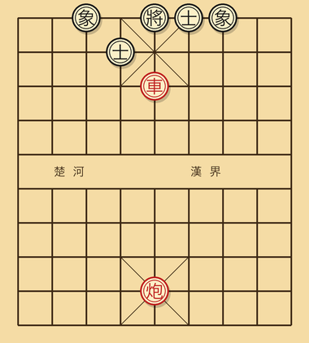

```
红：车在 5 路、五线（已过河进入对方中宫）。
红：炮在 5 路、底二线。
黑：将在 5 路底；中士在 4 路（已被引动）；其他士象齐全。
```

<details>
<summary>答案</summary>

```
1. 车五进一    将
   将 5 进 1   （上将，被迫）
2. 车五进一    再次将杀，或者直接走炮五进若干完成将杀
```

这是铁门栓杀法的一种变形：车在前面持续压迫，炮在后方沿中线提供火力支援，黑将无论上下移动都被锁在中线之上。

</details>

### 题 7

红方先走，两步杀。

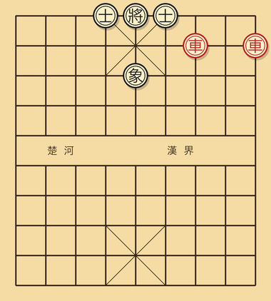

```
红：双车在 7 路、9 路（均已沉到对方底二线）。
黑：将在 5 路底；双士在 4、6 路；左象 5 路。
```

<details>
<summary>答案</summary>

```
1. 车九平六     将
   士 5 进 4    （吃车，被迫，否则被杀）
2. 车七进 X     将杀
```

这是双车错的标准杀法。一只车送进去引动对方士，另一只车顺势完成致命一击，两车之间形成完整的协同。

</details>

### 题 8

红方先走，两步杀。

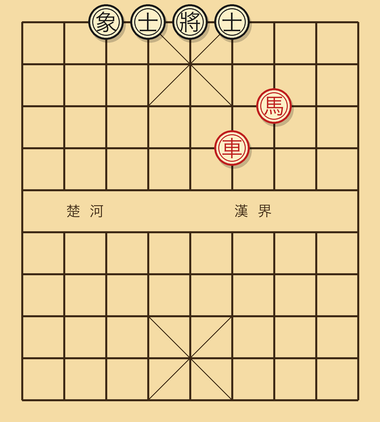

```
红：车一在 6 路四线；马二在 7 路三线（钓鱼位）。
黑：将在 5 路底；双士在 4、6 路。
```

<details>
<summary>答案</summary>

```
1. 车一进四     将
   士 6 退 5    （吃车，被迫）
2. 马跳到挂角位将杀，或者根据局面继续做杀
```

钓鱼马本身已经锁住了黑将的两个逃跑方向，车再从一侧发起强迫性将军，整个攻势就构成了钓鱼马配车的标准战术。

</details>

### 题 9

红方先走，两步杀。

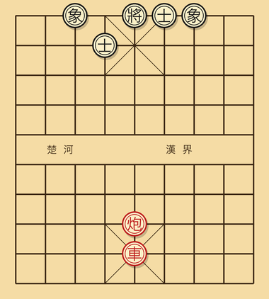

```
红：车在 5 路、二线；炮在 5 路、底三线（车后两格）。
黑：将在 5 路底；中士在 4 路（被引开）；右士在 6 路。
```

<details>
<summary>答案</summary>

```
1. 车五进六     将
   将 5 平 4    （只能横走）
2. 炮五平六     将杀
```

车在中线先把黑将逼向肋路，炮再借助前面留下的红车作为架子，完成最后一击。这一类杀法的关键在于车与炮的纵深配合。

</details>

### 题 10

红方先走，两步杀。

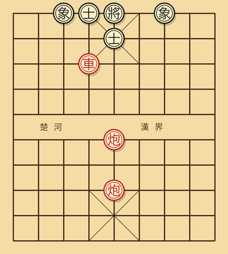

```
红：双炮在 5 路（叠在中线）；车在 4 路。
黑：将在 5 路底；中士在 4 路。
```

<details>
<summary>答案</summary>

```
1. 车四进 X     吃中士将（或引士）
   士回吃车     （被迫）
2. 前炮进 X     重炮将杀
```

这是引离战术加上重炮杀法的复合形态。车先去打掉对方关键的士，把对方防守阵型打乱，重炮再借势完成致命攻击。

</details>

### 题 11

红方先走，两步杀。

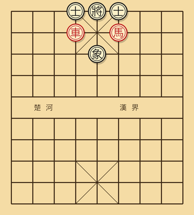

```
红：马在 6 路、二线（挂角）；车在 4 路、二线。
黑：将在 5 路底；4 路黑士；6 路黑士；中象在 5 路。
```

<details>
<summary>答案</summary>

```
1. 车四平六     将
   士 4 进 5    （吃车，被迫）
2. 马跳到 4 路一线，将杀
```

这是挂角马的连续战术。车先去送吃，把对方士引开，挂角马随后跳到关键格子，对黑将形成一击致命的攻击。

</details>

### 题 12

红方先走，两步杀（综合战术加杀法）。

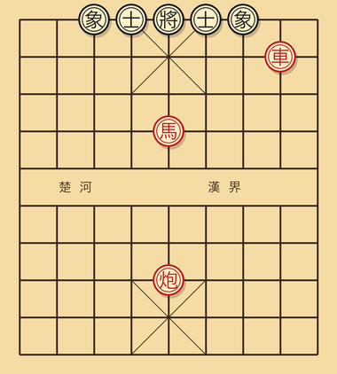

```
红：车在 8 路、底二线；马在 5 路、四线（窝心处但是在对方阵地，威胁中宫）；炮在 5 路、底三线。
黑：将在 5 路底；双士在 4、6 路；中象 5 路。
```

<details>
<summary>答案</summary>

```
1. 马五进六     （马跳出，攻击 4 路与 6 路两士的连接点）
   士 X 应      （被迫保护其中一边）
2. 车八进一     将杀（沉底配合中炮完成最后一击）
```

这一题结合了马的双向威胁与车炮的中线协同，是中残局阶段非常常见的攻王组合。

</details>

---

## 三步杀（题 13 至题 17）

### 题 13

红方先走，三步杀。

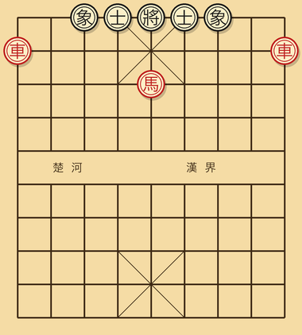

```
红：车一在 1 路、底二线；车二在 9 路、底二线；马在 5 路、三线。
黑：将在 5 路底；双士双象齐全。
```

<details>
<summary>答案</summary>

```
1. 车一进一     将（沉底将军）
   士 5 退 6    （吃车，被迫）
2. 马五进七     吃中士并攻击右象
   ...           （黑必失子）
3. 车二进一     将杀
```

这是双车错与马的协同杀法。第一只车主动送吃，把对方士引开，马顺势深入对方阵地，最后另一只车完成致命一击。

</details>

### 题 14

红方先走，三步杀。

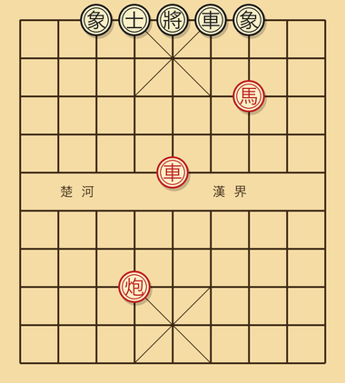

```
红：车在 5 路、五线（过河）；炮在 4 路、底三线；马在 7 路、三线（钓鱼位）。
黑：将在 5 路底；双士双象齐全；左车在 6 路、底线。
```

<details>
<summary>答案</summary>

```
1. 车五进 X     吃中士将
   将 5 平 4    （上将到 4 路，红炮位置不利）

实际更好的解法：
1. 马七进六     （挂角将军）
   将 5 进 1    （上将，被迫）
2. 车五进 X     抓将
   将 X 应      
3. 炮回杀位     将杀
```

这一题的关键在于先用马挂角发起将军，迫使黑将上行，再用车与炮的纵深配合完成最后的杀棋。

</details>

### 题 15

红方先走，三步杀。

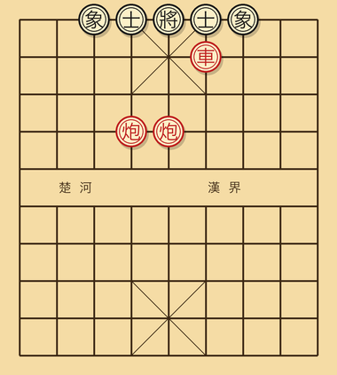

```
红：双炮（一只在 5 路、一只在 4 路，均已过河）；车在 6 路、底二线。
黑：将在 5 路底；双士双象齐全。
```

<details>
<summary>答案</summary>

```
1. 炮五进 X     将（吃中士）
   士 X 应吃    （被迫）
2. 车六进 X     沉底将
   士退         
3. 炮四进 X     重炮借车架杀
```

这是引离战术与重炮杀法的复合应用：先用炮打掉中士打开缺口，车再沉底逼迫对方退士，最后用第二只炮借助前面留下的车作为架子完成杀棋。

</details>

### 题 16

红方先走，三步杀。

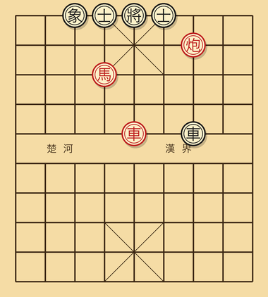

```
红：车在 5 路、五线；马在 4 路、三线；炮在 7 路、底二线。
黑：将在 5 路底；双士在 4、6；双象齐全；右车在 7 路、五线。
```

<details>
<summary>答案</summary>

```
1. 马四进六     将（挂角，先把对方的右士引开）
   士 6 进 5    （吃马，被迫）
2. 车五进 X     大胆穿心，吃中士将
   将 X 应      
3. 炮七进 X     沉底将杀
```

这是马、车、炮三件主力子的全面协同。马负责发起第一波将军并主动送吃以引动对方士，车随后完成穿心，最后炮沉底将杀。

</details>

### 题 17

红方先走，三步杀。

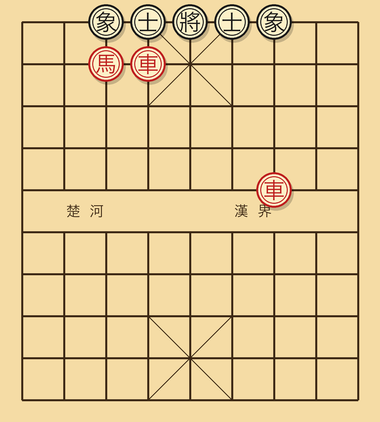

```
红：双车（左车 7 路五线、右车 4 路二线）；马在 3 路、三线（卧槽位）。
黑：将在 5 路底；双士在 4、6；双象齐全。
```

<details>
<summary>答案</summary>

```
1. 马三进五     将（窝心马跳，攻中宫）
   将 5 平 6    （只能横移到 6 路）
2. 车四进 X     将（4 路车直接攻王）
   士退         
3. 车七平五     将杀
```

这一题是双车加上马的三位一体杀法。马先迫使黑将横移，两只车再分别从中路和肋路完成围攻，构成完整的封锁。

</details>

---

## 综合战术题（题 18 至题 20）

### 题 18

红方先走，请找出最强的一步。

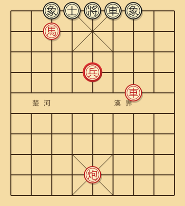

```
红：车在 7 路、五线；马在 3 路、三线（卧槽位）；炮在 5 路、底二线；中兵在 5 路、四线。
黑：将在 5 路底；左车在 6 路、底线；双士齐全；双象齐全。
```

<details>
<summary>答案</summary>

正解是**兵五进一**。

中兵直接进入对方九宫。这一步看似只是一颗兵的小动作，实际上含义非常深远：

- 中兵进入对方中宫之后，下一步可以直接吃掉中士。
- 黑方此时必须做出应对：如果用士吃兵，则中士被迫退出原本的防守位置，整个中宫的门户随之打开。
- 中士一旦退开，红炮加红车的中路攻势便会顺势打入，构成致命压力。

这是典型的"小兵立大功"的局面，过河兵在中残局阶段的实际价值接近一颗炮。

</details>

### 题 19

红方先走，要求在三步以内取得至少一颗子的优势。

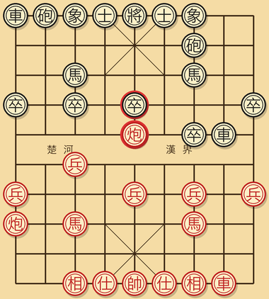

```
红：双车在二、八路；双马屏风；中炮过河至 5 线。
黑：双车（左车在 4 线、右车在底线）；屏风马；左炮（在 7 路、底二线）；右炮（在 2 路、底线）。
```

<details>
<summary>答案</summary>

正解是**炮五进若干**，红炮直接吃掉对方中卒并同时威胁黑士。

分析过程如下：黑方此时无法保护中卒，因为 7 路上的黑炮距离太远，无法及时回防；2 路上的黑炮虽然距离较近，却也来不及照顾到中路。红方吃掉中卒之后多出一颗兵的子力优势，并且中炮直接打入对方中线，对全局形成持续的威慑。

另一种选择是**车二进六**，让车过河抢占肋线。

具体如何选择，本质上是在贪兵（炮五进）与争势（车二进六）之间做权衡。两种思路都是正确的选择，最终取决于个人的下棋风格偏好。

</details>

### 题 20（综合判断）

下面给出一个完整的中局局面。请问：红方先走，最优的战略选择是什么？

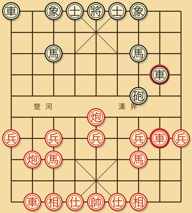

```
红：双车（左车 8 路四线，右车 2 路底线）；双马屏风；中炮在 5 路五线（已过河）；
    五兵都在；双相齐全；双士齐全。
黑：左车 9 路过河至 4 线；右车 1 路底线；屏风马；左炮过河至 7 路五线；
    右炮 8 路过河至 4 线（攻击红方 8 路车）；五卒齐全；双象齐全；双士齐全。

红车此时正被黑方右炮攻击。
```

<details>
<summary>答案</summary>

最直接的应对是**车八进二**或者**车八平七**，把正在被攻击的红车从原本的格子上移开。

不过更深入的判断需要把整个局面再走一遍：

- **子力**：双方完全对等，没有任何账面差距。
- **王安全**：双方士象都齐全，将帅的安全程度相当。
- **活跃度**：黑方明显更活跃，左车、左炮、右炮均已过河，红方却只有中炮过河。
- **要点**：黑方占据 4 线与 7 线两条横线，整体压力指向红方右翼。

综合来看，红方处于**略微劣势**，整体分数大约在负一分上下。因此战略方向应当是：

1. 优先解决眼前的具体威胁，把车从被攻击的格子撤走。
2. 不要急于反击，先把整体阵型稳定下来。
3. 利用红方中炮过河的位置优势，等待黑方攻势耗尽。黑方虽然过河子较多，但缺少重炮与双车合力一类真正的杀着结构。
4. 反击的主要方向应当放在中路。中炮可以选择平到 4 线去打黑方的过河炮，也可以选择退回去做拆架准备。

最佳的具体走法是**炮五退一**，这一步既威胁到了黑方的过河炮，又把炮收回到防守位置，是一手具备双重价值的着法。

</details>

---

## 推演表现自测评估

根据独立推演正解的题数，可对自身当前棋力阶梯做出清晰定位：

- **全部二十题无误**：已然突破入门壁垒，稳健迈入业余中坚水平。
- **正解十五至十九题**：扎实完成入门进阶，具备抗衡同阶高手的攻防底蕴。
- **正解十至十四题**：基本功仍存漏洞，当强化杀法构型的空间记忆。
- **正解十题以下**：建议重温前述章节，尤当深研第三章杀法图式，坚持每日推演数题以稳固棋感。

---

[← 上一章](07-中局策略.md) | [下一章 → 第九章 实战对局解析](09-实战对局.md)
