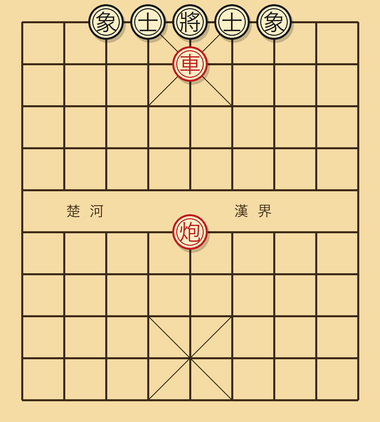
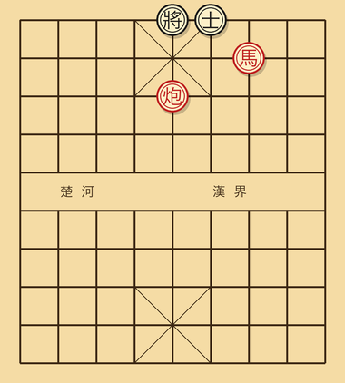
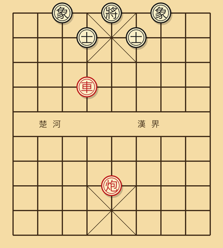
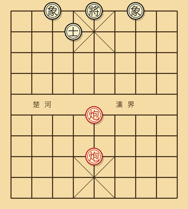
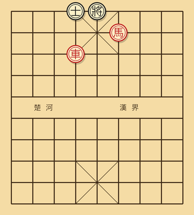

# 第八章 练习题

学了这么多，必须练。本章 20 道题，按难度递增。

**做题方法**：

1. 先盖住答案。把局面按描述摆到棋盘上（实物棋盘最好；找一个棋盘 App 也行）。
2. 算够 30 秒以上再看答案。
3. 错了的题做记号，第二天再做一遍。
4. 第一遍全做完之后，把所有题混在一起再做第二轮。

如果你能独立解出 15 道以上，水平已经可以稳定击败大多数业余棋手。

---

## 一步杀（题 1-5）

### 题 1

红先，一步杀。



```
红：车二在 5 路、底二线；炮三在 5 路、中线（即在车的更上方一格）。
黑：将在 5 路底；双士在 4、6 路。
```

<details>
<summary>答案</summary>

**车二进一**。沉底将军，配合中线红炮做铁门栓杀。

</details>

### 题 2

红先，一步杀。



```
红：马在 7 路、二线（卧槽位）。
红：炮在 5 路、底二线。
黑：将在 5 路底；左士在 6 路；右士已被吃。
```

<details>
<summary>答案</summary>

**马进六**（跳入 6 路、一线，将军黑将）。黑将无路可逃：5 路底被红炮控制，4 路被红马的下一格控制。马后炮的简化形。

</details>

### 题 3

红先，一步杀。



```
红：车一在 4 路、四线；炮二在 5 路、底三线。
黑：将在 5 路底；中士被吃；双象在 3、5 路。
```

<details>
<summary>答案</summary>

**车一平五**。直接杀入中宫。黑无士可挡（中士空），无法用象（象走田字，挡不到此点）。大胆穿心。

</details>

### 题 4

红先，一步杀。



```
红：双炮叠在 5 路（一前一后）；前炮在五线，后炮在底二线。
黑：将在 5 路底；中士被吃；其他士象齐全。
```

<details>
<summary>答案</summary>

**前炮进五**（前炮直接将军）。后炮当架子。黑无士可挡（中士空）。重炮杀。

</details>

### 题 5

红先，一步杀。



```
红：车在 4 路、底二线；马在 6 路、二线（挂角位）。
黑：将在 5 路底；4 路有黑士；其他防守残缺。
```

<details>
<summary>答案</summary>

**车四进一**。车吃 4 路士并将军，黑将无法逃（5 路被红马挂角控制，6 路也被马控制）。

</details>

---

## 两步杀（题 6-12）

### 题 6

红先，两步杀。

```
红：车在 5 路、五线（已过河进入对方中宫）。
红：炮在 5 路、底二线。
黑：将在 5 路底；中士在 4 路（已被引动）；其他士象齐全。
```

<details>
<summary>答案</summary>

```
1. 车五进一    将
   将 5 进 1   （上将，被迫）
2. 车五进一    （或炮五进 X 直接将杀）
```

进一步拆杀，铁门栓变形。

</details>

### 题 7

红先，两步杀。

```
红：双车在 7 路、9 路（均已沉到对方底二线）。
黑：将在 5 路底；双士在 4、6 路；左象 5 路。
```

<details>
<summary>答案</summary>

```
1. 车九平六     将
   士 5 进 4    （吃车，被迫，否则被杀）
2. 车七进 X     将杀
```

双车错的标准杀。

</details>

### 题 8

红先，两步杀。

```
红：车一在 6 路四线；马二在 7 路三线（钓鱼位）。
黑：将在 5 路底；双士在 4、6 路。
```

<details>
<summary>答案</summary>

```
1. 车一进四     将
   士 6 退 5    （吃车，被迫）
2. 马跳到挂角位将杀，或者根据局面继续做杀
```

钓鱼马 + 车的标准战术。

</details>

### 题 9

红先，两步杀。

```
红：车在 5 路、二线；炮在 5 路、底三线（车后两格）。
黑：将在 5 路底；中士在 4 路（被引开）；右士在 6 路。
```

<details>
<summary>答案</summary>

```
1. 车五进六     将
   将 5 平 4    （只能横走）
2. 炮五平六     将杀
```

</details>

### 题 10

红先，两步杀。

```
红：双炮在 5 路（叠在中线）；车在 4 路。
黑：将在 5 路底；中士在 4 路。
```

<details>
<summary>答案</summary>

```
1. 车四进 X     吃中士将（或引士）
   士回吃车     （被迫）
2. 前炮进 X     重炮将杀
```

引离 + 重炮的组合战术。

</details>

### 题 11

红先，两步杀。

```
红：马在 6 路、二线（挂角）；车在 4 路、二线。
黑：将在 5 路底；4 路黑士；6 路黑士；中象在 5 路。
```

<details>
<summary>答案</summary>

```
1. 车四平六     将
   士 4 进 5    （吃车，被迫）
2. 马跳到 4 路一线，将杀
```

挂角马的连续战术。

</details>

### 题 12

红先，两步杀（综合战术 + 杀法）。

```
红：车在 8 路、底二线；马在 5 路、四线（窝心处但是在对方阵地，威胁中宫）；炮在 5 路、底三线。
黑：将在 5 路底；双士在 4、6 路；中象 5 路。
```

<details>
<summary>答案</summary>

```
1. 马五进六     （马跳出，攻击 4、6 两士的连接点）
   士 X 应      （被迫保护一边）
2. 车八进一     将杀（沉底配合中炮）
```

</details>

---

## 三步杀（题 13-17）

### 题 13

红先，三步杀。

```
红：车一在 1 路、底二线；车二在 9 路、底二线；马在 5 路、三线。
黑：将在 5 路底；双士双象齐全。
```

<details>
<summary>答案</summary>

```
1. 车一进一     将（沉底将军）
   士 5 退 6    （吃车，被迫）
2. 马五进七     吃中士并攻击右象
   ...           （黑必失子）
3. 车二进一     将杀
```

双车错 + 马的协同。

</details>

### 题 14

红先，三步杀。

```
红：车在 5 路、五线（过河）；炮在 4 路、底三线；马在 7 路、三线（钓鱼位）。
黑：将在 5 路底；双士双象齐全；左车在 6 路、底线。
```

<details>
<summary>答案</summary>

```
1. 车五进 X     吃中士将
   将 5 平 4    （上将到 4 路，红炮位置不利）

实际更好的解法：
1. 马七进六     （挂角将军）
   将 5 进 1    （上将，被迫）
2. 车五进 X     抓将
   将 X 应      
3. 炮回杀位     将杀
```

</details>

### 题 15

红先，三步杀。

```
红：双炮（一只在 5 路、一只在 4 路，均已过河）；车在 6 路、底二线。
黑：将在 5 路底；双士双象齐全。
```

<details>
<summary>答案</summary>

```
1. 炮五进 X     将（吃中士）
   士 X 应吃    （被迫）
2. 车六进 X     沉底将
   士退         
3. 炮四进 X     重炮借车架杀
```

引离 + 重炮的复合战术。

</details>

### 题 16

红先，三步杀。

```
红：车在 5 路、五线；马在 4 路、三线；炮在 7 路、底二线。
黑：将在 5 路底；双士在 4、6；双象齐全；右车在 7 路、五线。
```

<details>
<summary>答案</summary>

```
1. 马四进六     将（挂角，先把对方的右士引开）
   士 6 进 5    （吃马，被迫）
2. 车五进 X     大胆穿心，吃中士将
   将 X 应      
3. 炮七进 X     沉底将杀
```

</details>

### 题 17

红先，三步杀。

```
红：双车（左车 7 路五线、右车 4 路二线）；马在 3 路、三线（卧槽位）。
黑：将在 5 路底；双士在 4、6；双象齐全。
```

<details>
<summary>答案</summary>

```
1. 马三进五     将（窝心马跳，攻中宫）
   将 5 平 6    （只能横移到 6 路）
2. 车四进 X     将（4 路车直接攻王）
   士退         
3. 车七平五     将杀
```

</details>

---

## 综合战术题（题 18-20）

### 题 18

红先，找最强一招。

```
红：车在 7 路、五线；马在 3 路、三线（卧槽位）；炮在 5 路、底二线；中兵在 5 路、四线。
黑：将在 5 路底；左车在 6 路、底线；双士齐全；双象齐全。
```

<details>
<summary>答案</summary>

**兵五进一**！

中兵直接攻入对方九宫。看似一颗兵的小动作，实际上：
- 中兵进入对方中宫，下一步可吃中士。
- 黑士被迫应对：用士吃兵（士退），导致中宫开门。
- 中士一退，红炮 + 红车的攻势直接打入。

经典的"小兵立大功"，过河兵在残局接近一颗炮的价值。

</details>

### 题 19

红先，三步内取得至少一颗子的优势。

```
红：双车在二、八路；双马屏风；中炮过河至 5 线。
黑：双车（左车在 4 线、右车在底线）；屏风马；左炮（在 7 路、底二线）；右炮（在 2 路、底线）。
```

<details>
<summary>答案</summary>

**炮五进 X**（吃中卒并威胁黑士）。

分析：黑无法保护中卒，因为 7 路黑炮太远，2 路黑炮也来不及防中。吃完中卒后红方多一颗兵，并且中炮直接打入对方中线，威慑大。

或者**车二进六**也是好招（车过河抢肋线）。

战略选择：贪兵（炮五进）还是争势（车二进六）。两种都正确，看个人风格。

</details>

### 题 20（综合判断）

下面给一个完整的中局局面。问：红方先走，最佳战略是什么？

```
红：双车（左车 8 路四线，右车 2 路底线）；双马屏风；中炮在 5 路五线（已过河）；五兵都在；双相齐全；双士齐全。
黑：左车 9 路过河至 4 线；右车 1 路底线；屏风马；左炮过河至 7 路五线；右炮 8 路过河至 4 线（攻击红方 8 路车！）；五卒齐全；双象齐全；双士齐全。

红车正被黑右炮攻击。
```

<details>
<summary>答案</summary>

**车八进二**或**车八平七**——最直接是把红车从被攻击的格子移开。

但更深入的判断：

- **子力**：双方完全对等。
- **王安全**：双方士象齐全，相当。
- **活跃度**：黑方更活跃（左车、左炮、右炮都已过河，红方只有中炮过河）。
- **要点**：黑方占据 4 线、7 线两条横线压力。

红方处于**略劣**（约 -1 分）。所以策略应该是：

1. 先解决眼前威胁（车八要避开）。
2. 不要急着反击，先稳定阵型。
3. 利用红方中炮过河的优势，等黑方攻势耗尽（黑方过河子虽多但缺少重炮、双车合力的形态）。
4. 反击点在中路。中炮可以平到 4 线打黑炮、或者退守做拆架。

具体最佳着法：**炮五退一**（同时威胁黑过河炮 + 退回防守位置）。这是一手两得的招。

</details>

---

## 解题表现自评

- **20/20**：你已经超过入门水平，进入业余中等。
- **15-19**：入门毕业，可以挑战中等水平的对手。
- **10-14**：基本功还需磨练，重点是杀法肌肉记忆。
- **10 以下**：把书前几章再读一遍，特别是第三章杀法。每天做 10 道杀法题，一个月后再回来。

---

[← 上一章](07-中局策略.md) | [附录 → 术语与记谱](99-术语对照.md)
