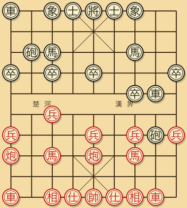
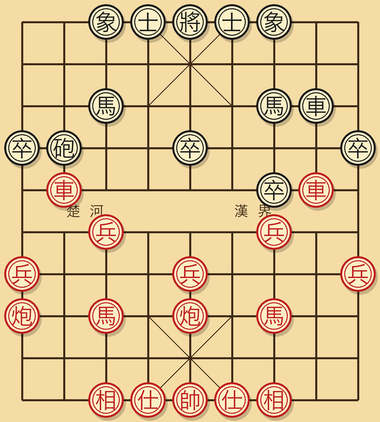
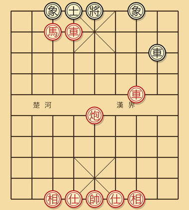

---
---

# 第九章 实战对局解析

研读完卷帙浩繁的理论之后，最直观的棋艺升华，莫过于脱谱复盘一盘完整的名家对局，将前述各章的概念逐一对应到具体着法之中。

本章精选一盘标准的"中炮对屏风马"经典实战，自起手开局一路推演至红方合围做杀。文中选取三大最具战略代表性的关键盘面节点定格剖析，抽丝剥茧地讲透每一步背后的战略图谋、各阶段局面的评估权衡，以及对手防守应对的深层逻辑。研读本章，前述八章中所阐述的子力分值、战术打击、几何杀型、开局法度与中局运筹，当在心智中融会贯通为一条清晰的战术链路。

## 9.1 开局阶段（第一至第六回合）

双方骨架走法如下：

```
1. 炮二平五   马 8 进 7
2. 马二进三   车 9 平 8
3. 车一平二   马 2 进 3
4. 兵七进一   卒 7 进 1
5. 马八进七   炮 8 进 4
6. 炮八平九   车 8 进 4
```



**此阶段的关键战略决断可归纳为五项**：

- 红方首步立**中炮**，为全盘奠定了"中轴压制、主动出击"的主基调，切合第五章所述的"抢先"原则。
- 黑方以**屏风马**针锋相对，意在依托双马护中筑起坚固防线，是对中炮最为中正的防守定式。
- 第四回合红方挺起**七路兵**，为八路马腾出前插通廊，黑方随即对应挺起 7 路卒遏制红马，此即"争势"与"抢先"的精准呼应。
- 第五回合黑方走**炮 8 进 4**，为左翼反攻的标志性着法。黑炮巡河过界，直接威逼红方三路马，战局张力骤然提升。
- 第六回合红方走**炮八平九**，平炮让道，既疏通八路通道以利左车出动，又从容避开黑方过河炮的直接射程。

**四维度盘面评估**：

| 维度 | 红方 | 黑方 |
|------|------|------|
| 子力对比 | 16 分（子力均等） | 16 分（子力均等） |
| 将帅安全 | 士象未动，后防安稳 | 士象未动，后防安稳 |
| 子力活跃 | 双马屏风、双车将出、中炮控中 | 屏风马稳固、左翼车炮齐过河 |
| 要点控制 | 掌控中轴五线 | 占有过河肋道要津 |

黑方左翼三大主力（车、马、炮）悉数激活投入前沿，攻势略显锋芒；红方则依托中炮保持中轴威慑，蓄势借右车反击。**全盘维持微妙均势，黑方微占主动**。

## 9.2 中局阶段：攻防对峙与战略转折

战局继续演进，中局交锋张力节节攀升：

```
7. 车九平八   炮 2 进 4    （黑方右炮亦过河，双炮齐逼红阵）
8. 兵九进一   炮 2 平 7    （黑方右炮平移 7 路，与左炮协同威逼红马）
9. 马三退一   炮 8 平 7    （红马退守边路，黑方双炮叠于 7 路构筑重炮威胁）
10. 车二进九  马 7 退 8    （红方果断以右车兑除黑方左车，黑方被迫退马）
11. 车二平四  ...
```



**此阶段的核心战略决断**：

- **第八回合黑炮 2 平 7**：此乃双炮重叠的序曲。黑方看似消耗一手将炮自 2 路移至 7 路，实则意在与左炮重叠构筑重炮形态，对红方翼侧施加毁灭性穿透力。此类着法正是初学者最易轻视的"阵型调度步"，看似平淡无奇，实乃深谋远虑的攻王前奏。
- **第十回合红车二进九**：红方主动以己方右车兑除黑方左车。**此处核心考量在于：红方为何欣然接受对等兑车？** 原因在于黑方过河强车长期据守要津，是红方阵地最难化解的战术威胁。一旦兑除，红方右翼瞬间从牵制中解放，可集中精力应对黑方双炮。此即第七章所述"借兑子消除主要威胁"的实战范例。
- 兑车之后，双方账面上各折一车，但**在有效子力的活跃度上红方反居上风**。黑方双炮虽叠于 7 路，但重炮攻势尚需多步准备；红方双马配合中炮的攻王序列已然具备随时启动的动能。

**红方下一步战略重心**：解除右翼束缚后，立时将主力向中央与敌方左翼集结，调动左车、双马与中炮，全面转入攻王阶段。

## 9.3 攻王阶段：经典杀型的合围

越过数回合中局纠缠，战局步入决定胜负的攻王节点：



**红方已然完成的兵力集结**：

- **红车一位于 4 路底二线**，沉底待发。
- **红车二位于 7 路五线**，横向封锁九宫要道。
- **红马驻守 3 路二线**，已然切入卧槽要津，直逼 5 路黑将。
- **中炮坐镇中轴**，提供纵深火力支援。
- 黑方防线在拉锯中已然受损：折损一士，象位亦现残缺。

**红方决胜收官着法**：

```
1. 马三进五   将（卧槽马跃入中宫叫将）
   将 5 平 4   （黑将受逼只能横移 4 路，中宫与 6 路皆受红车封锁）
2. 车四进一   将（4 路底二线红车直插底线叫将）
   士 X 应    （黑方被迫支士挡架）
3. 车七平四   将杀（另一红车平移 4 路，双车重叠，黑方无险可守，绝杀成型）
```

**此阶段所运用的杀法精要**：

- **卧槽马**（第三章 3.7 节）逼迫黑将移出中宫。
- **双车错变形**（第三章 3.1 节）完成最终收割。

**复盘总结**：

整盘对局红方的制胜主线可概括为：**先借精准兑子消弭对方最具威胁的攻击子（黑方过河车），旋即调集全部剩余主力向一翼发动合围攻王**。此乃中炮对屏风马最为纯正的实战赢法之一。通盘脉络极具法度：

1. 开局阶段（第一至第六回合）：双方依循标准理论出子，法度森严。
2. 中局阶段（第七至第十二回合）：黑方主动调动双炮求攻；红方沉着应对，以车换车瓦解危机，为总攻扫清障碍。
3. 攻王阶段：红方双车、双马与中炮多维协同，直扑防守残缺的黑王，从容锁定胜局。

**全盘真正的战略转折点出现在第十回合红车二进九**。若红方贪恋先手拒绝兑车，黑方双炮重炮攻势势必抢先发动，红方在完成攻王集结前极易陷入万劫不复之境。由此明晰：**精准把握兑子时机，乃是掌控胜负走向的无上心法**。

## 9.4 赛后复盘自检清单

每局对弈终了，无论胜负，皆当依循下列清单展开系统自省：

1. **开局阶段是否恪守三大原理？** 抢先、争势、谋子三项，自身达成了哪几条？又在何处出现了偏离？
2. **步入中局之际，自身对盘面优劣的裁量是否准确？** 赛后借助引擎复盘，其评分走势与自身当时预判是否存在严重偏差？偏差因何而生？
3. **全局推演中是否遗漏了绝杀契机？** 若有遗漏，是何种几何杀型未能敏锐识别？是卧槽马、马后炮还是双车错？赛后须重温第三章对应章节并精做习题。
4. **面临战略转折点时，决断依据为何？** 若换用另一分支选择，局势又将如何演化？
5. **对手最强反击着法是否在自身算度之内？** 落子前自身究竟推演到了对方后续第几回合的应手？

初学阶段棋力跃升的最快途径，正是**带着这份自检清单连续实战三十局，每局终了依此五条逐一作答并借助引擎复盘反省**。将这套闭环扎实走通，棋艺水平自会迎来质的突破。

---

[← 上一章](08-练习题.md) | [附录 → 术语与记谱](99-术语对照.md)
