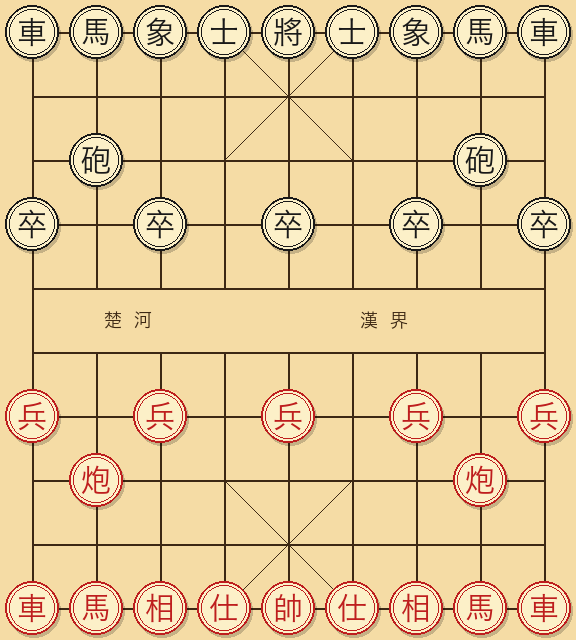

# 中国象棋入门到提高

📖 **在线阅读**：<https://yingwang.github.io/xiangqi-book/>

写给会下棋、但水平还在入门徘徊的人。

## 📑 目录

| # | 章节 | 内容 |
|---|------|------|
| 序 | [前言](00-前言.md) | 入门到提高这一段为什么最难 |
| 1 | [棋子价值与子力运用](01-棋子价值.md) | 子力分值、各子性格、配合原理 |
| 2 | [基本战术](02-基本战术.md) | 捉双 / 抽将 / 闪击 / 牵制 / 引离 |
| 3 | [基本杀法](03-基本杀法.md) | 双车错、大胆穿心、马后炮、卧槽马等 10 种 |
| 4 | [实用残局](04-实用残局.md) | 单车、车低兵、马残局的胜负判定 |
| 5 | [开局原理](05-开局原理.md) | 抢先、争势、谋子三原理 + 禁忌 |
| 6 | [常见开局](06-常见开局.md) | 中炮屏风马、反宫马、仙人指路、飞相局 |
| 7 | [中局策略](07-中局策略.md) | 局面四维度判断 + 攻王 / 慢攻 / 简化 |
| 8 | [练习题](08-练习题.md) | 一步杀 5 道、两步杀 7 道、三步杀 5 道、综合 3 道 |
| 附 | [术语与记谱](99-术语对照.md) | 四字记谱、术语速查、口诀 |

## 适合谁读

不教规则。不讲楚河汉界的故事。直接进入"怎么把棋下好"。

读完这本书，你应该能：

- 看懂职业棋手的棋谱，知道每一步背后的意图。
- 在朋友局里稳定取胜，不再被简单的双车错、马后炮一招毙命。
- 拿到一个开局后，知道接下来该干什么，而不是凭感觉乱走。
- 残局阶段能算清楚胜负和，不再"明明子力领先却被对方逼和"。

## 怎么用这本书

按顺序读。每一章后面都有几个例题，看完讲解先盖住答案自己想，想 30 秒以上再看。

杀法和战术是肌肉记忆，不是知识。光看不练，下盘棋还是看不见。每天花 10 分钟做几道杀法题，比读一小时理论更有用。

## 记谱法

全书用中国通用的"四字记谱法"。红方用汉字数字（一到九，从右到左），黑方用阿拉伯数字（1 到 9，从左到右，即各自从己方右手开始数）。动词三个：

- **平**：横向移动，第三字是目标纵线。例：`炮二平五` = 红方右炮（二线）横移到中线（五线）。
- **进**：向前。第三字是步数（车马炮兵）或目标纵线（马、相、士因走斜线另算）。例：`车一进四` = 一线红车前进 4 格。
- **退**：向后。规则同进。

两个同线棋子区分用"前/后"代替起始线。例：`前马进七`。

详细记谱规则见[附录](99-术语对照.md)。
